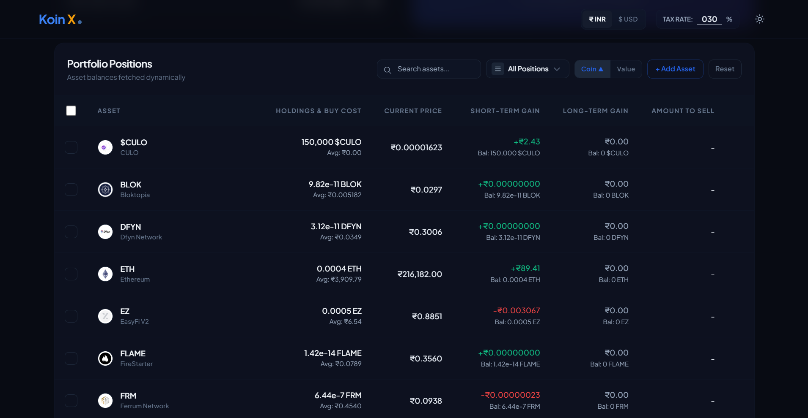
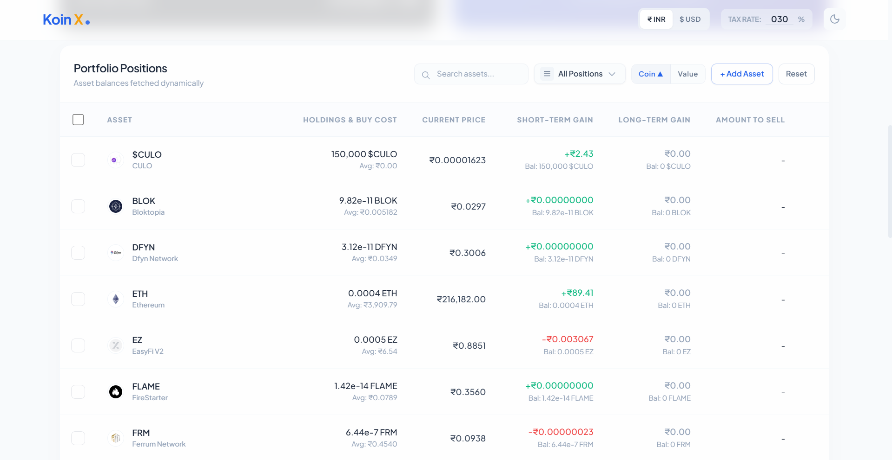
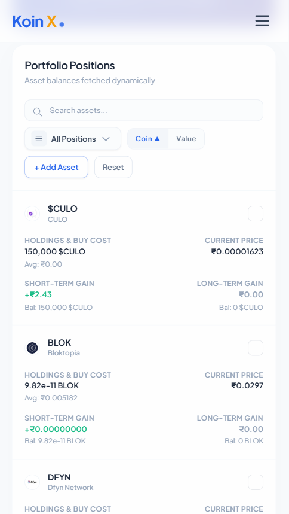
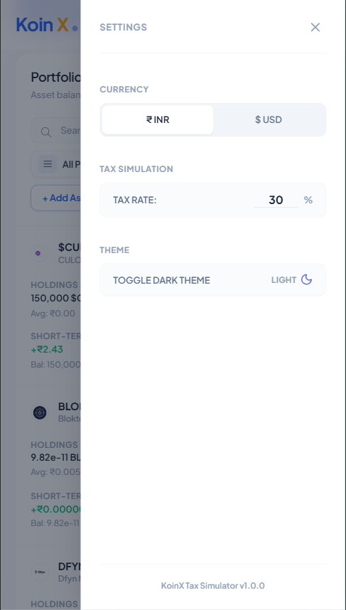

# 🌱 KoinX — Tax Loss Harvesting Dashboard

<div align="center">

**A production-grade, fully responsive Tax Loss Harvesting simulator for crypto investors.**
Visualize capital gains, simulate tax-saving strategies, and offset losses against profits — all in real time.

[](https://react.dev)
[](https://vitejs.dev)
[](https://tailwindcss.com)
[](LICENSE)

</div>

---

## 📸 Screenshots

> Drop your screenshots into `docs/screenshots/` and they'll render here automatically.

| Desktop — Dark Mode | Desktop — Light Mode |
|---|---|
|  |  |

| Mobile View | Filter Dropdown |
|---|---|
|  |  |

**How to add screenshots:**
1. Take screenshots of your UI (use Chrome → right-click → "Capture screenshot" or use DevTools mobile mode)
2. Save them to `docs/screenshots/` folder in this repo
3. Name them: `desktop-dark.png`, `desktop-light.png`, `mobile-view.png`, `dropdown-filter.png`
4. Push to GitHub — they'll appear automatically above

---

## ✨ Features — Complete List

### 📊 Capital Gains Dashboard
- **Pre-Harvesting Card** — Displays your current baseline capital gains (from the Capital Gains API) broken down into:
  - Short-Term Capital Gains (STCG) Profits
  - Short-Term Capital Gains (STCG) Losses
  - STCG Net Gains
  - Long-Term Capital Gains (LTCG) Profits
  - Long-Term Capital Gains (LTCG) Losses
  - LTCG Net Gains
  - Total Realised Capital Gains (STCG Net + LTCG Net)
- **After-Harvesting Card** — Live simulation of your gains after selecting holdings to offset. Updates in real time as you check/uncheck positions.
  - Shows updated STCG/LTCG Profits, Losses, Net Gains
  - Shows Effective Capital Gains (post-offset)
  - **"You're going to save ₹X"** callout — only appears when harvesting actually reduces your gains

### ☑️ Portfolio Positions Table
- Fetches holdings from the mock Holdings API with realistic parallel loading (via `Promise.all`)
- Displays per-asset: Coin logo, Ticker, Full name, Total balance, Average buy price, Current price, STCG gain/loss, LTCG gain/loss
- **Checkbox selection** — Check an asset to include it in your harvest simulation
  - Automatically sets `amountToSell = totalHolding` on check
  - Unchecking reverts `amountToSell` to 0 and removes it from simulation
- **Amount to Sell input** — Appears per row when an asset is checked; lets you simulate a partial sell
  - Proportionally adjusts the gain/loss contribution (`gain × amountToSell / totalHolding`)
  - Clamped between `0` and `totalHolding` — no invalid inputs possible

### 🔍 Search, Filter & Sort
- **Real-time search** — Filter positions by coin ticker (e.g. "ETH") or full name (e.g. "Ethereum")
- **Premium Filter Dropdown** — Filter your portfolio view by position type:
  - `All Positions` — Show entire portfolio
  - `Loss Positions` — Show only assets with negative STCG or LTCG gains (ideal for harvesting)
  - `Gain Positions` — Show only assets with positive gains
  - `Selected Only` — Show only currently checked/selected assets
- **Sort controls** — Sort table by:
  - `Coin` — Alphabetical A→Z / Z→A
  - `Value` — By total holding value (high→low / low→high)
- **View All / Show Less** — Paginated display; shows 6 entries by default with a "View All (N assets)" toggle

### ➕ Add Custom Position
- Full-featured modal form to inject a custom asset into the simulator
- Required fields: Coin Symbol, Coin Name, Balance, Current Price, Average Buy Price
- Optional fields: Logo URL, STCG Gain/Loss, STCG Balance, LTCG Gain/Loss, LTCG Balance
- Custom assets get prefixed `custom-` IDs and are pre-checked with full sell amount on add
- Includes a 🗑️ delete button (only on custom assets, not on API-fetched ones)

### 💱 Currency Toggle (INR ↔ USD)
- Switch all displayed values between **Indian Rupee (₹)** and **US Dollar ($)** instantly
- Conversion uses the USDC current price from the Holdings API as the live USD/INR rate (`1 USD = ₹85.41`)
- Accessible from the top navigation bar on desktop, and from the Settings drawer on mobile
- Currency preference is **persisted in localStorage** across sessions

### 📐 Tax Rate Simulator
- Configurable tax rate input in the navigation header (`TAX RATE: 30%` by default)
- Accepts values `0–100%` — changes how much tax savings are estimated
- **Formula:** `Tax Saved = (Pre-harvest Gains − Post-harvest Gains) × Tax Rate`
- Tax savings callout only appears when post-harvest gains are *lower* than pre-harvest gains
- Tax rate preference is **persisted in localStorage**

### 🌙 Dark / Light Theme
- Toggle between dark and light modes from the navbar (desktop) or Settings drawer (mobile)
- Automatically detects system color scheme preference on first load (`prefers-color-scheme`)
- Theme preference is **persisted in localStorage** via the `ThemeContext`

### 📱 Full Mobile Responsiveness
- **Desktop (≥640px):** Full 8-column table layout with horizontal scroll support
- **Mobile (<640px):** Each holding transforms into a sleek vertical card showing all data cleanly
  - Card header: Coin logo, name, ticker, and checkbox toggle
  - 2×2 metric grid: Holdings & Avg Buy Cost, Current Price, STCG Gain, LTCG Gain
  - Animated "Amount to Sell" inline input appears at the bottom of the card when selected
  - Custom assets show a 🗑️ trash icon for deletion
- **Hamburger menu** on mobile — slides in a settings drawer from the right with:
  - Currency switcher (INR / USD)
  - Tax rate input
  - Dark/Light theme toggle
  - Smooth `slideInRight` animation with backdrop blur overlay

### ⏳ Skeleton Loaders & Smooth Transitions
- **Initial load:** Full-page shimmer skeleton shown while both APIs resolve in parallel
- **Reset action:** Synchronized skeleton loaders in both the summary cards AND the holdings table
  - No page flickers — only the numbers and rows animate out while the layout stays fixed
  - 400ms simulated latency for a natural feel
- **Row animations:** `animate-fade-in` on new rows, `animate-slide-up` on sections

### 📋 Jurisdiction Disclaimer Banner
- Collapsible accordion with important tax notes (open by default)
- Shows a prominent ⚠️ amber warning when currency is set to INR:
  > *"Tax-loss harvesting is currently not allowed under Indian VDA tax regulations (Section 115BBH)"*
- Lists rules: VDA restrictions, no derivatives support, CoinGecko pricing disclaimer, realized-only losses, STCG/LTCG jurisdiction differences

---

## 🗂️ Project Structure

```
react_tax_harvest/
├── public/                          # Static public assets
├── docs/
│   └── screenshots/                 # 📸 Add your UI screenshots here
│
├── src/
│   ├── main.jsx                     # App entry — renders ThemeProvider + App
│   ├── App.jsx                      # Root: layout, navigation, mobile drawer, routing
│   ├── index.css                    # Tailwind layers, global styles, keyframe animations
│   │
│   ├── context/
│   │   └── ThemeContext.jsx         # Global dark/light theme state + useTheme hook
│   │
│   ├── hooks/
│   │   └── useLocalStorage.js       # Generic persistent-state hook (try/catch safe)
│   │
│   ├── components/
│   │   └── ui/                      # Reusable primitive UI components
│   │       ├── Checkbox.jsx         # Accessible animated custom checkbox
│   │       ├── Tooltip.jsx          # Hover tooltip with positioning support
│   │       ├── Card.jsx             # Generic card container wrapper
│   │       ├── Input.jsx            # Styled labeled input field
│   │       ├── Select.jsx           # Styled select dropdown
│   │       └── Accordion.jsx        # Animated collapsible section
│   │
│   └── features/
│       └── tax-harvesting/          # Self-contained feature module (domain-driven)
│           │
│           ├── components/
│           │   ├── SummaryCards.jsx        # Pre/Post harvesting gain cards with skeleton loaders
│           │   ├── HoldingsTable.jsx       # Portfolio table (desktop) + card list (mobile)
│           │   ├── AddAssetModal.jsx       # Custom position entry modal form
│           │   └── JurisdictionBanner.jsx  # Tax rules disclaimer accordion
│           │
│           ├── hooks/
│           │   └── useTaxHarvesting.js     # Core feature hook: state, mock API, actions
│           │
│           ├── utils/
│           │   └── taxCalculator.js        # Pure calculation functions (gains, offsets, savings)
│           │
│           └── data/
│               └── initialHoldings.js      # Mock API response payloads (holdings + capital gains)
│
├── tailwind.config.js               # Custom theme tokens, brand colors, animation config
├── postcss.config.js                # Autoprefixer setup
├── vite.config.js                   # Vite + React plugin config
├── eslint.config.js                 # ESLint rules (react-hooks, react-refresh)
└── package.json                     # Scripts, dependencies
```

---

## 🧠 Architecture & Design Decisions

| Pattern | Rationale |
|---|---|
| **Feature-based folder structure** | All tax-harvesting logic is co-located in one domain folder — scales cleanly as new features are added |
| **Custom `useTaxHarvesting` hook** | Encapsulates all state, derived data, mock API calls, and actions — keeps UI components pure and easy to test |
| **`useMemo` for gain calculations** | Prevents recalculating gains on every render; recomputes only when `holdings`, `capitalGains`, `taxRate`, or `currency` change |
| **`useLocalStorage` hook** | Persists user preferences (currency, tax rate, theme, holdings) without any external state library |
| **`Promise.all` mock API pattern** | Simulates real parallel API calls (Holdings + Capital Gains) with independent latency delays — mirrors production patterns |
| **Pure `taxCalculator.js` utilities** | All math is side-effect-free and easily unit-testable without React |
| **Context API for theme** | Lightweight alternative to Redux; includes system-preference detection and proper context guard |
| **Proportional gain scaling** | `gain × (amountToSell / totalHolding)` — accurately simulates partial sells, not just full-holding offsets |

---

## 📐 Tax Calculation Explained

```
━━━━━━━━━━━━━━━━━━━━━━ PRE-HARVESTING (Baseline) ━━━━━━━━━━━━━━━━━━━━━━━━━

  Net STCG  = STCG Profits  −  STCG Losses    →  e.g. ₹70,200 − ₹1,548 = ₹68,652
  Net LTCG  = LTCG Profits  −  LTCG Losses    →  e.g. ₹5,020 − ₹3,050 = ₹1,970
  Realised Capital Gains = Net STCG + Net LTCG →  ₹68,652 + ₹1,970 = ₹70,622

━━━━━━━━━━━━━━━━━━━ AFTER HARVESTING (On checkbox select) ━━━━━━━━━━━━━━━━

  For each selected asset:
    ratio = amountToSell / totalHolding            (partial sell support)
    stGain = asset.stcg.gain * ratio
    ltGain = asset.ltcg.gain * ratio

    if (stGain > 0)  → additionalStProfits += stGain
    if (stGain < 0)  → additionalStLosses += |stGain|
    (same for ltGain)

  Post STCG Net  = (Baseline STCG Profits + additionalStProfits)
                 − (Baseline STCG Losses  + additionalStLosses)
  Post LTCG Net  = (Baseline LTCG Profits + additionalLtProfits)
                 − (Baseline LTCG Losses  + additionalLtLosses)
  Effective Gains = Post STCG Net + Post LTCG Net

━━━━━━━━━━━━━━━━━━━━━━━━━━ TAX SAVINGS ━━━━━━━━━━━━━━━━━━━━━━━━━━━━━━━━━━━

  Gains Saved = Realised Gains − Effective Gains
  Tax Saved   = Gains Saved × Tax Rate         (only when Gains Saved > 0)

  ⚠️  "You're going to save ₹X" is only shown when:
       Post-harvest gains < Pre-harvest gains
```

---

## 🚀 Setup Instructions

### Prerequisites

Make sure you have the following installed before you begin:

| Tool | Version | Check |
|---|---|---|
| **Node.js** | `v18+` | `node -v` |
| **npm** | `v9+` | `npm -v` |
| **Git** | Any | `git --version` |

### Step 1 — Clone the Repository

```bash
git clone https://github.com/YOUR_USERNAME/react_tax_harvest.git
cd react_tax_harvest
```

### Step 2 — Install Dependencies

```bash
npm install
```

> This installs React 19, Vite, Tailwind CSS, Lucide React, and all dev tooling.
> No extra environment variables or `.env` files are needed — the project runs entirely on mock data.

### Step 3 — Start the Development Server

```bash
npm run dev
```

Open [http://localhost:5173](http://localhost:5173) in your browser.
Hot Module Replacement (HMR) is enabled — changes reflect instantly without a full reload.

### Step 4 — (Optional) Clear Saved State

This app persists holdings, currency, tax rate, and theme in your browser's `localStorage`.
If you want a **completely fresh start** (reset to the mock API defaults):

1. Open Chrome DevTools → **Application** tab → **Local Storage** → `http://localhost:5173`
2. Click **Clear All**, then refresh the page

Or use the **Reset** button inside the app (top-right of the Portfolio Positions table).

### Step 5 — (Optional) Build for Production

```bash
npm run build
```

Output is in the `dist/` folder — a fully static build ready to deploy anywhere.

```bash
# Preview the production build locally
npm run preview
```

### Step 6 — (Optional) Lint the Codebase

```bash
npm run lint
```

---

## 🔌 Mock API Reference

This project simulates two concurrent backend endpoints:

### `GET /api/holdings` — Portfolio Holdings
```json
[
  {
    "coin": "ETH",
    "coinName": "Ethereum",
    "logo": "https://coin-images.coingecko.com/...",
    "currentPrice": 211756,
    "totalHolding": 0.5,
    "averageBuyPrice": 150000,
    "stcg": { "balance": 0.5, "gain": 3000 },
    "ltcg": { "balance": 0, "gain": 0 }
  }
]
```

### `GET /api/capital-gains` — Existing Realised Gains
```json
{
  "capitalGains": {
    "stcg": { "profits": 70200.88, "losses": 1548.53 },
    "ltcg": { "profits": 5020, "losses": 3050 }
  }
}
```

Both APIs are resolved in parallel using `Promise.all` with simulated latency (500ms + 800ms).

---

## 🛠️ Tech Stack

| Technology | Version | Role |
|---|---|---|
| **React** | 19 | UI framework |
| **Vite** | 8 | Build tool & dev server |
| **Tailwind CSS** | 3.4 | Utility-first styling |
| **Lucide React** | latest | Icon library |
| **PostCSS + Autoprefixer** | 8 | CSS processing |
| **ESLint** | 10 | Code quality (react-hooks, react-refresh) |

**No Redux. No React Router. No external state libraries.**
Everything is managed with React's built-in hooks + Context API.

---

## 📦 Deployment

### Vercel (recommended — zero config)
```bash
npm i -g vercel
vercel
```

### Netlify
```bash
npm run build
# Upload the dist/ folder at netlify.com/drop
```

### GitHub Pages (via gh-pages)
```bash
npm install --save-dev gh-pages
# Add to package.json: "homepage": "https://YOUR_USERNAME.github.io/react_tax_harvest"
# Add scripts: "predeploy": "npm run build", "deploy": "gh-pages -d dist"
npm run deploy
```

---

## 💡 Assumptions

The following assumptions were made during development based on the assignment brief and standard tax-loss harvesting rules:

### Business / Domain Assumptions

| # | Assumption |
|---|---|
| 1 | All monetary values in the Holdings API response are stored and processed in **Indian Rupees (INR)** as the base currency. USD conversion is applied at display-time only. |
| 2 | The **USD/INR conversion rate** is derived from the `currentPrice` of the USDC token in the Holdings API (`1 USD = ₹85.41`). No live forex API is used. |
| 3 | When a holding is **checked**, the default `amountToSell` is set to `totalHolding` (i.e., simulate selling the entire position). The user can then reduce this. |
| 4 | Gain/loss contribution is **proportionally scaled**: `gain × (amountToSell / totalHolding)`. Partial sells are fully supported. |
| 5 | The **"You're going to save ₹X"** banner is shown **only when** post-harvest effective gains are strictly less than pre-harvest realised gains. No savings are shown for selections that increase total gains. |
| 6 | **Tax savings** = `Gains Reduced × Tax Rate`. Default tax rate is **30%**, configurable from 0–100%. |
| 7 | **STCG and LTCG are tracked independently** — a loss in STCG does not automatically offset an LTCG profit (each is bucketed separately, then summed for effective gains). |
| 8 | Only **realized losses** (assets you are selling) are considered for harvesting. Unrealized losses (held assets you don't sell) are excluded from the calculation. |
| 9 | **Tax-loss harvesting is not legally valid for Indian VDA (Virtual Digital Asset) gains** under Section 115BBH of the Income Tax Act. This is a simulator only — a prominent disclaimer banner is shown to Indian users (INR mode). |
| 10 | Crypto derivatives, futures, and business income are **out of scope** — this tool handles spot holdings only. |
| 11 | Some jurisdictions have no STCG/LTCG split — in those cases, all gains are treated as long-term by default. |

### Technical Assumptions

| # | Assumption |
|---|---|
| 1 | **No backend** is required. Both the Holdings API and Capital Gains API are mocked using `Promise.all` with realistic simulated latency (`800ms` and `500ms` respectively). |
| 2 | The mock API data defined in `initialHoldings.js` exactly mirrors the schema expected from the real KoinX backend APIs. |
| 3 | Holdings and user preferences (currency, tax rate, theme) are **persisted in `localStorage`** across browser sessions. Clearing localStorage resets the app to defaults. |
| 4 | The mock API only runs **on first load** (when localStorage is empty). Subsequent page loads restore from localStorage directly to avoid re-flashing the skeleton. |
| 5 | **Custom-added assets** are identified by their `id` prefix (`custom-COIN-timestamp`) and may be deleted by the user. API-fetched assets (`coin-COIN-index`) cannot be deleted. |
| 6 | All calculation logic lives in **pure utility functions** (`taxCalculator.js`) with no React dependencies, making them independently testable. |
| 7 | The app is a **single-page application (SPA)** with no routing — all views and modals are managed through conditional rendering and local component state. |
| 8 | **No authentication, user accounts, or server persistence** — all data is client-side only. |

---

## 📝 License

MIT © [Your Name](https://github.com/YOUR_USERNAME)

---

<div align="center">
  Built with ❤️ as part of the <strong>KoinX Frontend Engineering Assignment</strong>
  <br />
  <sub>React 19 · Vite 8 · Tailwind CSS · No external state managers</sub>
</div>
